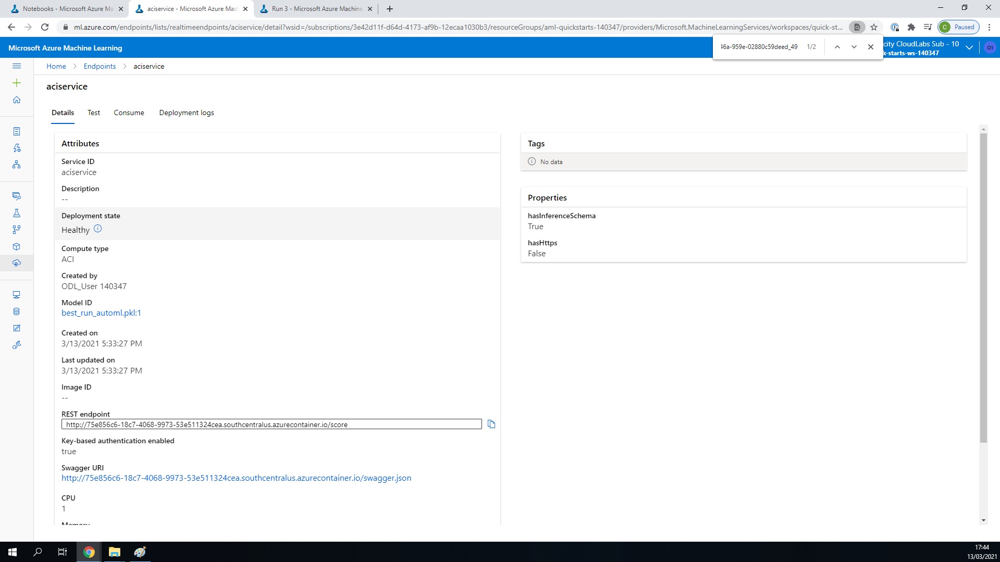
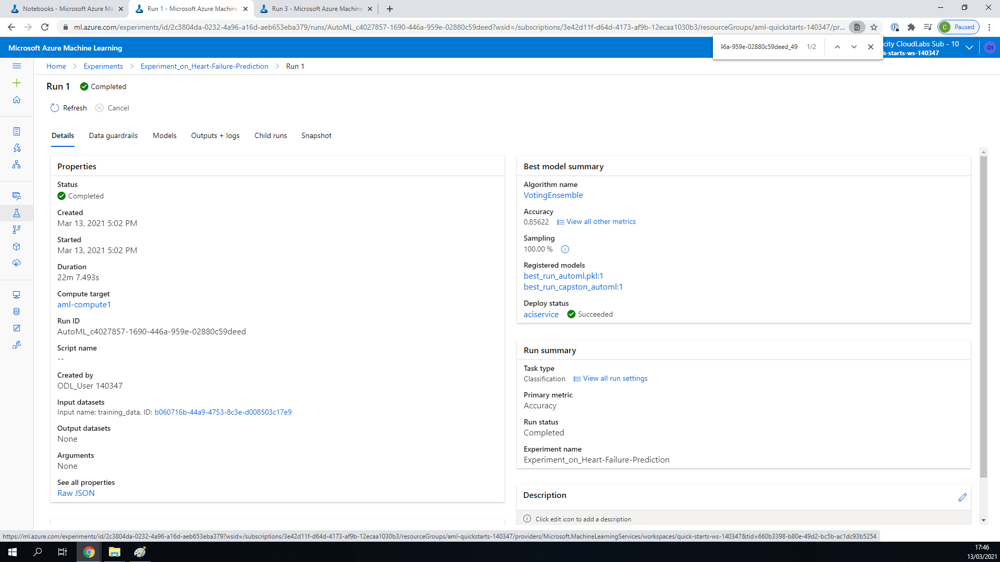
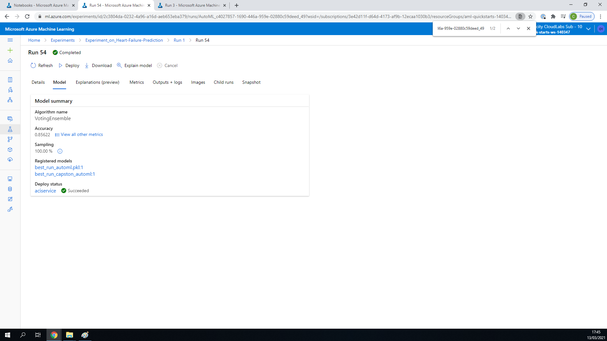
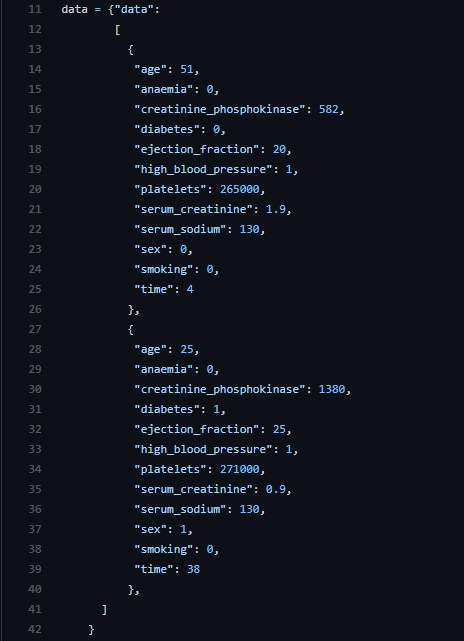
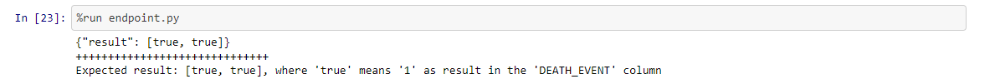
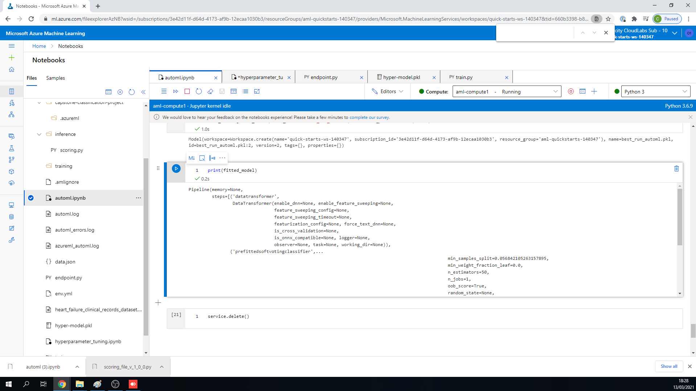
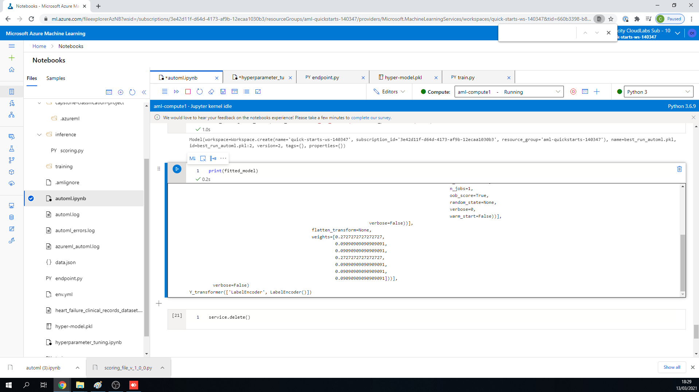

# Capstone Project for Azure Machine Learning Engineer Nanodegree in Udacity 

This project is the capstone project for "Machine Learning Engineer for Microsoft Azure" Udacity's Nanodegree. In this project we will choose 
a public external dataset. This dataset will be used for train a model using 1) an Automated ML 2) Hyperdrive. After we will compare the performance of these
two different algorithms and deploy the best model. Finally the endpoint produced will be used to get some answers about predictions.

## Project Files 
In this repo you will find the following files, which required to run the experiments: 
* automl.ipynb :  It is the notebook file for the AutoML.
* endpoint.py : This is the python script I used to consume the produced endpoint.
* train.py : A python script that the HyperDrive operates on in order to produce the runs and find the best model.
* hyperparameter_tuning.ipynb : This is the notebook file I used for the HyperDrive. 
* heart_failure_clinical_records_dataset.csv : This is the dataset I used from [here](https://www.kaggle.com/andrewmvd/heart-failure-clinical-data).
The following came out from the running of the experiments:
* env.yml : This is the environment file I downloaded from the Azure ML Studio. 
* hyper-model.pkl : This is the best model from the HyperDrive I downloaded from Azure ML studio.
* model.pkl :  This is the best model from the AutoML I downloaded from Azure ML studio.
* scoring_file_v_1_0_0.py : I downloaded this script from Azure Machine Learning Studio and it is used to deploy the model.


## Dataset

### Overview

The dataset I used is [heart_failure_clinical_records_dataset.csv](https://www.kaggle.com/andrewmvd/heart-failure-clinical-data). It describes some recorded health indicators metrics. The data have almost 300 rows of these indicators recorded from patients. 

### Task

I am using this data in order to predict the DEATH_EVENT i.e. whether or not the patient deceased during the follow-up period (boolean). The features of the data are the following:

age : The age of the patient.

anaemia : Decrease of red blood cells or hemoglobin (boolean).

creatinine_phosphokinase : Decrease of red blood cells or hemoglobin (boolean).

diabetes : If the patient has diabetes (boolean).

ejection_fraction : Percentage of blood leaving the heart at each contraction (percentage).

high_blood_pressure : If the patient has hypertension (boolean).

platelets : Platelets in the blood (kiloplatelets/mL).

serum_creatinine : Level of serum creatinine in the blood (mg/dL).

serum_sodium : Level of serum sodium in the blood (mEq/L).

sex : Woman or man (binary).

smoking : If the patient smokes or not (boolean).

time : Follow-up period (days).

DEATH_EVENT : If the patient deceased during the follow-up period (boolean).


### Access

I upload the dataset in the Azure ML studio from local file (the one that I have uploaded also here in github heart_failure_clinical_records_dataset.csv). As you can see in either the automl.ipynb and hyperparameter_tuning.ipynb the code is checking whether or not the .csv has been uploaded, if not then the code makes the dataset getting it from this repo. 

## Automated ML

The AutoML settings I have used are below : 

```
automl_settings = {"n_cross_validations": 2,
                    "primary_metric": 'accuracy',
                    "enable_early_stopping": True,
                    "max_concurrent_iterations": 4,
                    "experiment_timeout_minutes": 20,
                    "verbosity": logging.INFO
                    }
```      

```
automl_config = AutoMLConfig(compute_target = compute_target,
                            task='classification',
                            training_data=dataset,
                            label_column_name='DEATH_EVENT',
                            path = project_folder,
                            featurization= 'auto',
                            debug_log = "automl_errors.log",
                            enable_onnx_compatible_models=False,
                            blocked_models = ['XGBoostClassifier'],
                            **automl_settings
                            )
```

* ```n_cross_validations``` : It is how many cross validations set to make when user validation data is not specified. The main set of data is split to ```n=2``` sets and it is performed train on the one of the two and validation to the other set. So this procedure is performed two times, because we have ```n_cross_validations=2```. 

* ```primary_metric = 'accuracy' ``` :  The metric that Automated Machine Learning will optimize for model selection. We have set the 'accuracy'.

* ``` enable_early_stopping = True``` : Whether to enable early termination if the score is not improving in the short term. 

* ``` max_concurrent_iterations = 4``` : The maximum number of iterations that could be executed in parallel.  It is recommended you create a dedicated cluster per experiment, and match the number of max_concurrent_iterations of your experiment to the number of nodes in the cluster. This way, you use all the nodes of the cluster at the same time with the number of concurrent child runs/iterations you want. For this I set it to 4.

* ``` experiment_timeout_minutes = 20 ``` :  It defines how long, in minutes, your experiment should continue to run. In previous projects we couldn't set more than 30 minutes. In this project we could use more but it is not needed for so small training set. However, it is for sure something that you could change for better performance.

* ``` "verbosity": logging.INFO ``` : It is the verbosity level you want to produced.

* ``` compute_target = compute_target``` : The compute target with specific vm_size and max_nodes. The one that has been configured with name 'aml_compute' in the automl.ipynb.

* ``` task='classification' ``` : We have a classification task to do, we seek to predict whether or not the person will have a heart failure. With other words we are trying to predict the ``` DEATH_EVENT ```.

* ``` training_data = dataset ``` : The data on which the algorithm will be trained.

* ``` label_column_name='DEATH_EVENT' ``` : The name of the column that contains the labels of the train data, i.e the target column we want to predict.

* ``` path= project_folder``` : The path to the Azure ML folder of the project.

* ``` featurization= 'auto' ``` : Indicator for whether featurization step should be done automatically or not, or whether customized featurization should be used. I used ``` auto``` so featurization step step should be done automatically.

* ``` debug_log = "automl_errors.log" ``` : The debug information are written to the  ```automl_errors.log```.

* ``` enable_onnx_compatible_models = False ``` : Whether to enable or disable enforcing the ONNX-compatible models.

* ``` blocked_models = ['XGBoostClassifier'] ``` : What algorithm we want from AutoML to not run. I selected ``` XGBoostClassifier```, the answer could be found in the 
[forum](https://knowledge.udacity.com/questions/509841). For those who don't have access, I have to say that it is for compatibility issues. So the lack of time to make the ``` XGBoostClassifier``` to run make me to enforce the AutoML to not run this specific algorithm. 


### Results

In the below screenshots you can verify that the best run is the one at the below table: 
Best algorightm | VotingEnsemble
--- | ---  
Run Id | AutoML_c4027857-1690-446a-959e-02880c59deed_49
Accuracy | 0.85622
AUC macro | 0.89710
AUC micro | 0.90959

This screenshot is inside the Jupyter Notebook automl.ipynb shows all the details of the best run, its id, its ```automl_settings``` and many other details such as the compute target at which ran:

This screenshot is from the Azure ML studio but not from the Jupyter Notebook. It is in the Experiment in the Run of AutoML. It shows the best algorithm(up and right) and its accuracy. It has of cource and other details such as the duration of AutoML Run: 

Here we are in the the specific Run of Voting Ensemble within the general Run of AutoML we see in the above screenshot. It shows the accuracy,AUC micro, AUC macro(up and right) of this specific algorithm now. There are also again other details such as the duration and the id of this specific run:


I think that there is a lot of space to improve the above results. Some improvements could be : 
1) Set bigger ```n_cross_validation``` equals to 5 or 7. I think 2 sets are somehow small. 
2) I would let the algorithm to run for much more time. Thus I would change  ``` "experiment_timeout_minutes": 20 ``` to an hour or more. 
3) I would somehow enables also the ``` XGBoostClassifier ``` to run and fix the compatibility issues.
4) I would disable the early stopping policy and thus set ``` enable_early_stopping = False```.


In the following screenshots we can see the `RunDetails` widget : 
At the below screenshots we can see, back in the Jupyter Notebook automl.ipynb, the Run Details. We see a every time another part of the widget but all the screenshots depict the same cell. We see the status whether is running or not(1st screenshot), and some details of specific runs(2nd,3rd screenshot).


## Hyperparameter Tuning

Tha algorithm used for the training is Logistic Regression. The two hyperparameters of the Logistic Regression are tuned with the hyperdrive to find the model with the best accuracy on the test set. The two hyperparameters are the following:

``` C ``` : The inverse of the reqularization strength. The smaller the number the stronger the regularization.

``` max_iter ``` : Maximum number of iterations to converge.

**Benefits of the parameter sampler**

I chose the ```RandomParameterSampling```, the hyperparameters are randomly selected from the search space. The search space for the two hyperaparameters is the following:

```
   '--C' : choice(0.001,0.01,0.1,1,10,20,50,100,200,500,1000),
   '--max_iter': choice(50,100,300)
```
where the choice define discrete space over the values. The benefits of the ```RandomParameterSampling```, is that it is more fast than for example the ```GridParameterSampling``` where all the possible values from the search space are used, and it supports early termination of low-performance runs.

I chose the ```BanditPolicy``` which is an "aggressive" early stopping policy with the meaning that cuts more runs than a conservative one like the ```MedianStoppingPolicy```, so it saves computational time. There are three configuration parameters ```slack_factor, evaluation_interval(optional), delay_evaluation(optional)```. 
* ```slack_factor/slack_amount``` : (factor)The slack allowed with respect to the best performing training run.(amount) Specifies the allowable slack as an absolute amount, instead of a ratio.

* ```evaluation_interval``` : (optional) The frequency for applying the policy.

* ```delay_evaluation``` : (optional) Delays the first policy evaluation for a specified number of intervals.

I set ```evaluation_interval=2, slack_factor=0.1```.

About the other parameters of the ```HyperDriveConfig``` : 

* ```primary_metric_name='Accuracy'``` : Meaning that our interest is about the 'Accuracy'. 
                                    

* ```primary_metric_goal=PrimaryMetricGoal.MAXIMIZE```: Meaning that we want to Maximize the primary metric and not minimize it for example.

* ```policy=early_termination_policy``` : This is where I have set the policy I described above.

* ```max_concurrent_runs=4 ``` : Maximum number of runs to run concurrently. Of course the best is 4 as it is the number of cluster nodes.

* ```max_total_runs=16``` : Maximum number of runs. This is the upper bound, there may be fewer runs when the sample space is smaller than this value. 

### Results

In the below screenshots you can verify that the best run is the one at the below table: 
runId | HD_d145f066-c650-4d4a-877b-0b85cc305c65_0
--- | ---  
 Accuracy | 0.778 
 Regularization Strength  | 500
 Max Iterations | 50
 
This screenshot is inside the Jupyter Notebook hyperparameter_tuning.ipynb shows all the details of the best run, its id, its ```automl_settings``` and many other details such as the compute target at which ran:

The below screenshots are from the Azure ML studio but not from the Jupyter Notebook. It is in the Experiment section in the Run of Hyperdrive inside the best Run. The best Run here is not another algorithm but specific parameters (C,max_iter) of the same algorithm applies to each run inside the Hyperdrive run: 


We can understand that there is a lot of difference from the perspective of accuracy between the Hyperdrive and the AutoML since the last hit an accuracy of ```0.85622``` and the hyperdive's accuracy is ```0.778```. Some improvements for the Hypderdrive method could be :

1) Set a ```GridParameterSampling``` so we can check more hyperparameters for better results.
2) Change the policy to a more "conservative" one. I would set as policy the ```MedianStoppingPolicy``` so the runs wouldn't stop more easy.
3) Set as ```max_total_runs``` a much more big number.

In the following screenshots we can see the `RunDetails` widget : 
At the below screenshots we can see, back in the Jupyter Notebook hyperparameter_tuning.ipynb, the Run Details. We see a every time another part of the widget but all the screenshots depict the same cell. We see the in these photos when the run started(1st screenshot), logs(2nd screenshot), when it finished and the compute target(3rd screenshot).


## Model Deployment

The best model came out from the AutoML, this is sure from what we have seen from the above results. 
The model that I have deployed in order to consume it is the one that produced with the VotingEnsemble algorithm.

About the deployment configurations, I will analyse some of them : 
``` 
deployment_config = AciWebservice.deploy_configuration(cpu_cores = 1, 
                                                    memory_gb = 1, 
                                                    auth_enabled= True, 
                                                    enable_app_insights= True)
```
* ``` AciWebservice ``` : A deployed service is created from a model, script, and associated files. The resulting web service is a load-balanced, HTTP endpoint with a REST API. 
* ``` auth_enabled = True``` : Whether or not to enable authentication for this Webservice. I have enabled the autentication.
* ``` enable_app_insights = True ``` : Whether or not to enable AppInsights for this Webservice. I have enabled it and you can see exactly what is it viewing my screen recording video.

Below you can see the screenshots of the endpoint as active.
This screenshot is from inside the aciservice(the endpoint). It shows the endpoint as Healthy(up and left), the rest endpoint you must call it in order to consume the endpoint(down and left) and also thw Swagger URI. It also shows which model has been deployed(middle left). 

This screenshot shows the Deploy Status as Succeeded(middle right). This is inside the Run of AutoML.

This screenshot shows the Deploy Status as Succeeded(left). This is inside the best Run of the Run of AutoML.


If you want to consume it you can use a python script as the [endpoint.py](https://github.com/michav1510/Capstone-Project-Azure-Machine-Learning-Engineer/blob/main/endpoint.py). You have to know the ```scoring_uri``` which is the url of the REST endpoint and the key(primary or secondary). Send it with a json and then you will take an answer. 
The following screenshots depict the json that are in the [endpoint.py](https://github.com/michav1510/Capstone-Project-Azure-Machine-Learning-Engineer/blob/main/endpoint.py)(first screenshot) and the corresponding answers(last screenshot) which are both true as we can see: 




The below screenshots are some extra screenshots show the fitted model of the automl.ipynb. It is inside the Jupyter Notebook automl.ipynb:



## Screen Recording

[Here](https://youtu.be/2oCTfpyBISc) you can see a screen recording which shows : 
- A working model
- Demo of the deployed  model
- Demo of a sample request sent to the endpoint and its response


## Future Improvements 

* I have pointed the future improvements I would suggest for both the AutoML and the HyperDrive in the corresponding sections. 
* About the dataset I would suggest to increase the sample data because 299 rows of data is very very small.

 
